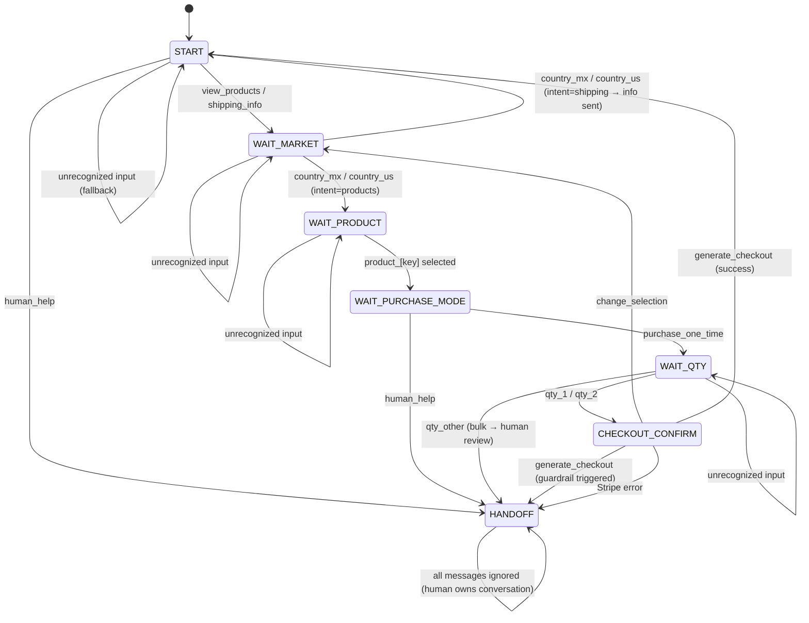

# WhatsApp Commerce Flow — RockeyHub State Machine

> This document describes the deterministic state machine that powers the RockeyHub WhatsApp commerce experience. It is the core technical differentiator of the platform.

---

## Design Philosophy

The WhatsApp bot operates as a **deterministic finite-state machine** — not a free-form AI chatbot. Every state transition is explicit, every action is logged, and every checkout step is validated against the product catalog before proceeding.

**Why deterministic?**
- Predictable behavior reduces support load
- Each state can be tested independently
- Guardrails prevent invalid orders from reaching Stripe
- Idempotency is enforced at the entry point

---

## State Machine Diagram



---

## State Definitions

### `START`
Entry point for all new and returning sessions.

**Accepted inputs:**
| Interactive ID | Action |
|---|---|
| `view_products` | Ask for market, move to `WAIT_MARKET` |
| `shipping_info` | Ask for market, move to `WAIT_MARKET` (intent=shipping) |
| `human_help` | Move to `HANDOFF` |
| *(any other)* | Show main menu again (fallback) |

---

### `WAIT_MARKET`
Determine the customer's purchasing market for correct pricing and geo-fencing.

**Accepted inputs:**
| Interactive ID | Action |
|---|---|
| `country_mx` | Set `market = 'MX'` in context |
| `country_us` | Set `market = 'US'` in context |

**Context stored:** `{ market: 'MX' | 'US', intent: 'products' | 'shipping' }`

If `intent = 'shipping'`: send shipping rules text, return to `START`.
If `intent = 'products'`: query catalog, send interactive list, move to `WAIT_PRODUCT`.

---

### `WAIT_PRODUCT`
Display available products from `product_catalog_matrix_view` for the selected market.

**Catalog query filters:**
```sql
WHERE bot_menu_enabled = true
  AND market = :market
  AND stripe_env = 'test'         -- MVP: always test
  AND purchase_mode = 'one_time'
ORDER BY bot_menu_order ASC
```

**Context stored:** `{ product_key: string }`

---

### `WAIT_PURCHASE_MODE`
Confirm the purchase type. Monthly/recurring blocked in MVP — only one-time available.

**Context stored:** `{ purchase_mode: 'one_time' }`

---

### `WAIT_QTY`
Collect quantity. Bulk orders (> 2) are routed to `HANDOFF` for personalized attention.

**Context stored:** `{ quantity: 1 | 2 }`

---

### `CHECKOUT_CONFIRM`
Show order summary and generate Stripe Checkout Session.

**Guardrails validated before Stripe call:**

| Check | Fail behavior |
|---|---|
| `global_active === false` | → HANDOFF |
| `bot_checkout_enabled === false` | → HANDOFF |
| `stripe_price_id === 'pending_stripe'` | → HANDOFF |
| `quantity > requires_human_review_above_qty` | → HANDOFF |

**On success:**
1. `order_draft` created in DB with `status: 'draft'`
2. Stripe Checkout Session created (hosted UI, geo-fenced shipping)
3. `order_draft` updated with `stripe_session_id`, calculated amounts
4. Checkout URL sent via WhatsApp CTA button
5. Session reset to `START`

---

### `HANDOFF`
Human operator takes over. All incoming messages are silently ignored by the bot.

**Trigger conditions:**
- User explicitly requests `human_help`
- Bulk order quantity detected
- Any catalog guardrail fails
- Stripe API error

---

## Idempotency

Every inbound webhook is deduplicated using the `wamid` (WhatsApp Message ID):

```
POST /whatsapp-inbound
    ↓
INSERT INTO whatsapp_inbound_logs (wamid, wa_id, payload)
    ↓
ON CONFLICT (wamid) → return 200 "Duplicated message ignored"
    ↓
processMessage() called only for new messages
```

This prevents duplicate orders and duplicate messages in case of webhook retries from Meta.

---

## Session Persistence

Sessions are stored in `whatsapp_sessions`:

| Field | Type | Description |
|---|---|---|
| `wa_id` | text (PK) | WhatsApp phone number |
| `current_state` | text | Active state name |
| `context_data` | jsonb | Accumulated context across states |
| `updated_at` | timestamp | Last activity |

`context_data` accumulates across states:
```json
{
  "intent": "products",
  "market": "MX",
  "product_key": "greenbnano_starter",
  "purchase_mode": "one_time",
  "quantity": 2
}
```

---

## Message Types Used

| Type | When Used |
|---|---|
| `text` | Simple informational messages, error fallbacks |
| `interactive.button` | 2–3 option decisions (market, qty, confirm) |
| `interactive.list` | Product catalog (up to 10 items) |
| `interactive.button` (CTA) | Checkout URL delivery |

All outbound messages use the Meta Graph API v20.0 `/{phone_number_id}/messages` endpoint.

---

## Post-Payment Flow

After Stripe payment confirmation, the `stripe-webhook` Edge Function:

1. Verifies Stripe signature (`HMAC-SHA256`)
2. Reads `client_reference_id` → maps to `order_draft_id`
3. Updates `order_draft.status` → `'paid'`
4. Stores customer shipping address from Stripe session
5. Triggers post-sale automation (future: Conversions API, University module)
